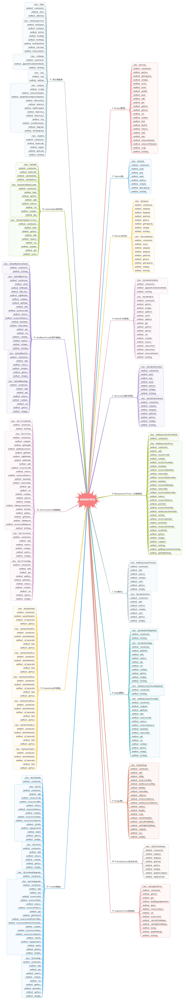

# Mao Data Structures

## Description

[ from eggshells to flying in the sky ] JS Data Structure Analysis and Algorithm Implementation, the overall content of the article roughly as follows:
Arrays(数组)、Stacks(栈)、Queues(队列)、Linked List(链表)、Recursion(递归思想)、Binary Search Tree(二分搜索树)、Set(集合)、Map(映射)、Heap(堆)、Priority Queue(优先队列)、Segment Tree(线段树)、Trie(字典树)、Union Find(并查集)、AVL Tree(AVL 平衡树)、Red Black Tree(红黑平衡树)、Hash Table(哈希表)

Source Code has three: ES6 | js + HTML | Java

Source Code related articles have been published to [juejin](https://juejin.im/user/5c4ad8b85188252d3b3e3c9e) and [segmentfault](https://segmentfault.com/u/aiyodiao/articles), Just look at the article can master 20% , hands-on tapping code, brain thinking, drawing can master 80% .

This is suitable for, people who want to understand and are interested in data structure, collate these notes and source code, and the time span is also nearly half a year Hopefully it will be useful for people who want to learn about data structures or who are learning about data structures.



## Catalog

Finishing

```
├─001-Arrays
│  ├─001-Array-Basics
│  ├─002-Create-Our-Own-Array
│  ├─003-Add-Element-in-Array
│  ├─004-Query-and-Update-Element
│  ├─005-Contain-Find-and-Remove
│  ├─006-Generic-Data-Structures
│  ├─007-Dynamic-Array
│  └─008-Amortized-Time-Complexity
├─002-Stacks-and-Queues
│  ├─001-Create-Our-Own-Stack
│  ├─002-Stack-Valid-Parentheses-In-Leetcode
│  ├─003-Create-Our-Own-Queue
│  └─004-Queues-Comparison
├─003-Linked-List
│  ├─001-Linked-List-Basics
│  ├─002-Add-Elements-In-LinkedList
│  ├─003-DummyHead-In-LinkedList
│  ├─004-Query-And-Update-In-LinkedList
│  ├─005-Remove-Element-In-LinkedList
│  ├─006-Implement-Stack-In-LinkedList
│  ├─007-Stacks-Comparison
│  └─008-Implement-Queue-In-LinkedList
├─004-Recursion
│  ├─001-Remove-LinkedList-Elements
│  ├─002-Test-Your-LinkedList-Solution
│  ├─003-Recursion-Basics
│  ├─004-Recursion-Remove-LinkedList-Elements
│  └─005-Debug-Recursive-Solution
├─005-Binary-Search-Tree
│  ├─001-Binary-Search-Tree-Basics
│  ├─002-Add-Elements-In-BST
│  ├─003-Improved-Add-Elements-In-BST
│  ├─004-Search-Elements-In-BST
│  ├─005-PreOrder-Traverse-In-BST
│  ├─006-Debug-PreOrder-Traverse-In-BST
│  ├─007-InOrder-And-PostOrder-Traverse-In-BST
│  ├─008-Non-Recursion-PreOrder-Traverse-In-BST
│  ├─009-Level-Traverse-In-BST
│  ├─010-Remove-Min-And-Max-In-BST
│  └─011-Remove-Elements-In-BST
├─006-Set-And-Map
│  ├─001-Set-Basics-And-BSTSet
│  ├─002-Create-Our-Own-LinkedListSet
│  ├─003-Time-Complexity-Of-Set
│  ├─004-TreeSet-And-Set-Problems-In-Leetcode
│  ├─005-Map-Basics
│  ├─006-Create-Our-Own-LinekdListMap
│  ├─007-Create-Our-Own-BSTMap
│  ├─008-Time-Complexity-Of-Map
│  └─009-LeetCode-Problems-About-Map-And-Set
├─007-Heap-And-Priority-Queue
│  ├─001-Heap-Basics
│  ├─002-Add-Elements-And-Sift-Up-In-Heap
│  ├─003-Extract-Max-Element-And-Sift-Down-In-Heap
│  ├─004-Heapify-And-Replace-In-Heap
│  ├─005-Priority-Queue
│  └─006-Priority-Queue-Problems-In-Leetcode
├─008-Segment-Tree
│  ├─001-Segment-Tree-Basics
│  ├─002-Building-Segment-Tree
│  ├─003-Query-In-Segment-Tree
│  ├─004-Segment-Tree-Problems-In-Leetcode
│  └─005-Update-Single-Element-In-Segment-Tree
├─009-Trie
│  ├─001-Trie-Basics
│  ├─002-Searching-In-Trie
│  ├─003-Prefix-In-Trie
│  ├─004-Trie-And-Pattern-Match
│  ├─005-Trie-And-Map
│  └─006-Trie-About
├─010-UnionFind
│  ├─001-UnionFind-Interface
│  ├─002-Quick-Find
│  ├─003-Quick-Union
│  ├─004-Optimized-By-Size
│  ├─005-Optimized-By-Rank
│  ├─006-Path-Compression
│  └─007-More-About-Union-Find
├─011-AVL-Tree
│  ├─001-Calculating-Balance-Factor
│  ├─002-Checking-Balancing-And-Binary-Search-Property
│  ├─003-Rotation-Operations
│  ├─004-The-Implementation-Of-Left-Rotation-And-Right-Rotation
│  ├─005-LR-And-RL-In-AVLTree
│  ├─006-Remove-Elements-In-AVL-Tree
│  └─007-Map-And-Set-In-AVL-Tree
├─012-Red-Black-Tree
│  ├─001-The-Equivalence-Of-RBTree-And-2-3-Tree
│  ├─002-Keep-Root-Black-And-Left-Rotation
│  ├─003-Flip-Colors-And-Right-Rotation
│  ├─004-Adding-Elements-In-Rad-Black-Tree
│  ├─005-Time-Complexity-Of-Red-Black-Tree
│  └─006-The-Performance-Of-Red-Black-Tree
└─013-Hash-Table
    ├─001-Hash-Table-Basics
    ├─002-Hash-Function
    ├─003-Hash-Table-Implementation
    ├─004-Resizing-In-Hash-Table
    └─005-More-About-Resizing-In-Hash-Table
```

## Instructions

1. Front View Code: ES6 Folder, editor add this folder
2. Front-end to see the code effect: JS folder, open the sub-folder inside the index. HTML
3. BACK-END CODE PLUS RUN EFFECTS: Java folders, the editor opens subfolders in the project

## Contribution

Finishing
